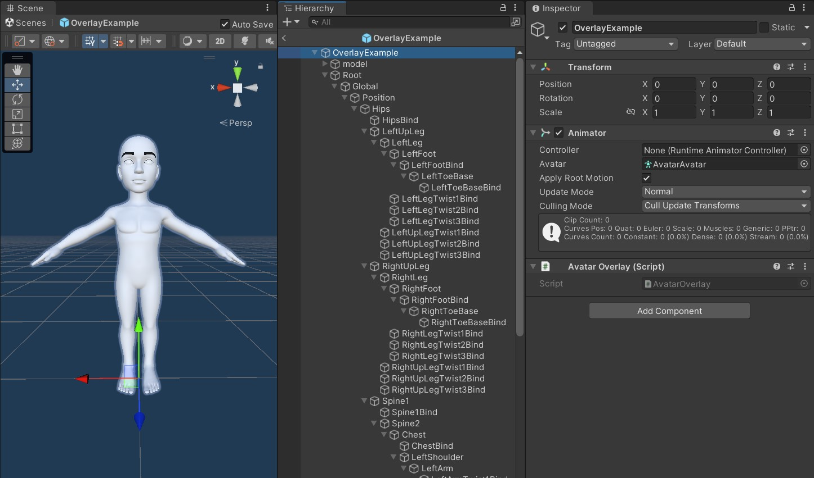

# Avatar overlays

Avatar overlays are prefabs that you can add to the [`UserAvatar` component](LoadingAvatars.md) so they are put on top of the avatar when loaded. You can have as many overlays as you want on top of a single avatar.

Overlay prefabs always contain the `AvatarOverlay` component. This component doesn't provide any configuration or functionality and it is only used internally to reference overlays.

## Creating overlays

You can create an overlay prefab by right clicking anywhere within the *Project* window and choosing `Create/Genies SDK/Avatar Overlay Prefab`.

The new prefab will contain the `AvatarOverlay` component, a basic humanoid avatar plus an Animator (only for previewing purposes) and the `Root` GameObject containing the hierarchy that represents the avatar bones structure.

You can add new GameObjects and components anywhere on the `Root` GameObject hierarchy so they are automatically instantiated on each avatar that uses the overlay. You must not add any GameObjects named as bones within the same parent. For example you can add a GameObject named "Hips" anywhere except under the "Position" bone object which already contains it.

Anything added to the prefab root or the `model` GameObjects as well as any changes to the transformation of bone GameObjects will be ignored.

## Using overlays

Once you have created some overlay prefabs you can add or remove them from the `UserAvatar` component. You can either add the overlays directly on the inspector or manage them at runtime from script graphs. Checkout the [Loading avatars](LoadingAvatars.md) documentation for more information.
