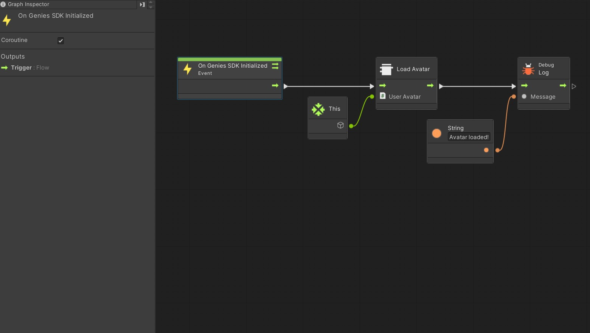
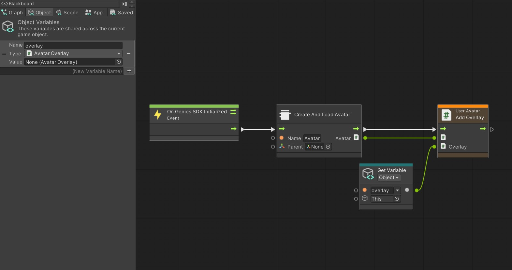

# Loading avatars

Avatars are loaded and controlled through the `UserAvatar` component. You can add this component to any GameObject to represent an avatar instance loaded from the user account. You can setup the following settings on the inspector:
* **Animator Controller**: the animator controller that will be automatically assigned to the avatar animator when loaded.
* **Overlays**: a list containing references to [`AvatarOverlay` prefabs](AvatarOverlays.md) that will be instantiated on top of the avatar when loaded.

You can also change the animator controller and the equipped overlays at runtime from any script graph asset by using the following nodes:
* **Set Animator Controller**
* **Add Overlay**
* **Remove Overlay**

You can safely destroy any GameObject containing a `UserAvatar` component and all the resources associated with the loaded avatar will be released from memory.

## Loading the user avatar

The `UserAvatar` component will not automatically load the avatar when playing the scene. You must trigger the load from a script graph using the `Genies SDK/Load Avatar` node, setting your target `UserAvatar` component as the input. This node is a coroutine so don't forget to setup the calling event as a coroutine too.

You must await for the Genies SDK to be initialized before loading an avatar. For that purpose you can use the `Events/Genies SDK/On Genies SDK Initialized` event node.

Here is a script graph example of how to load an avatar for a `UserAvatar` component added to the same GameObject running the script. The `On Genies SDK Initialized` node is selected so you can see how it is marked as a Coroutine.

As soon as the SDK is initialized the avatar will be loaded using the settings from the `UserAvatar` component available in the GameObject executing the script.

## Using the `Create And Load Avatar` node

This visual scripting node offers an alternative way to load avatars where you don't need to setup any `UserAvatar` component. It will create a new GameObject in the scene with `UserAvatar` and load the avatar at the same time. You can then setup any animator controller and overlays from the script graph after the load is complete.

This input parameters for this node are:
* **Name**: the name of the instantiated GameObject.
* **Parent**: the parent transform where the GameObject will be instantiated on. Leave it null if you want it at the scene root.

The following script graph will create and load a `UserAvatar` GameObject at the root of the scene named "Avatar" and set an overlay coming from the Object variables.

